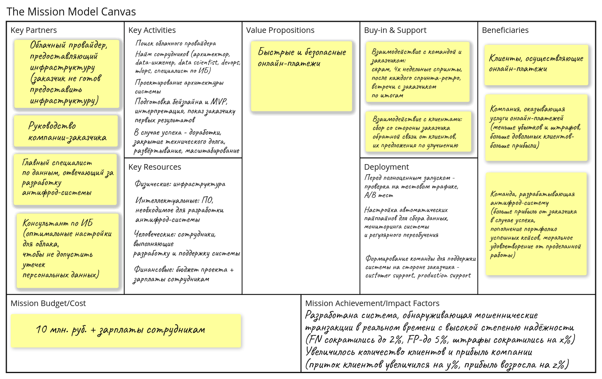

# Предварительный анализ задачи определения мошеннических финансовых операций

## Цели проектируемой антифрод-системы в соответствии с требованиями заказчика

1. Модуль на базе машинного обучения должен работать в режиме реального времени, обеспечивая пропускную способность до 400 транзакций/сек, при этом задержка на обработку одной транзакции не должна превышать 1 сек.
2. Вероятность ложноотрицательного срабатывания (далее **FN**, пропуск мошеннической транзакции) должна быть меньше 2% (т.к. вероятность мошеннической транзакции составляет 2%), при этом в месяц система может делать не более $k$ пропусков, где $`k=\dfrac{total\_damage}{\mathbb{E} \xi}`$, $\xi$ - случайная величина, характеризующая сумму мошеннической транзакции, $`total\_damage = 500 000`$ (т.к. на данном этапе данные недоступны, более конкретно определить нельзя)
3. Вероятность ложноположительного срабатывания (далее **FP**, определение обычной транзакции как мошеннической) должна быть меньше 5% (при превышении 5%-ного порога начинается отток клиентов)
4. Система должна быть защищена от взломов. В частности, модуль на базе машинного обучения должен работать с анонимизированными данными, чтобы минимизировать утечки при разработке.

## Выбор метрики машинного обучения

Для данной задачи характерен сильный дисбаланс классов (мошенническая/не мошенническая транзакция), при этом ошибка **FN** в 2.5 раза существеннее, чем **FP**, но они обе важны. Если будем минимизировать только **FN**, можно получить большое количество ошибок **FP** и может начаться отток клиентов, которые будут недовольны частой блокировкой транзакций. С другой стороны, минимизация только **FP**, может привести к большому количеству ошибок **FN**, система будет часто пропускать мошеннические транзакции, клиенты будут нести убытки, и также начнётся их отток. Метрика, позволяющая минимизировать **FN** - **Recall**; метрика, позволяющая минимизировать **FP** - **Precision**, будем использовать их взвешенное среднее гармоническое $\mathrm{F}_{\beta}$ с $\beta=2.5$:
$$\mathrm{F}_{\beta} = \left(1 + \beta^2\right)\dfrac{Precision \cdot Recall}{\beta^2\cdot Precision + Recall}$$
Таким образом **Recall** получит больший вес, но и **Precision** также будет учитываться. Исходя из целей, хорошая система должна обеспечивать $\mathrm{F}_{\beta} > 0.74$ - при таком пороге на 100 транзакций при двух обнаруженных фактически мошеннических можно допустить до пяти ошибок **FP**, при одной обнаруженной фактически мошеннической - до двух ошибок **FP**, при отсутствии мошеннических транзакций и ошибках **FP** $\mathrm{F}_{\beta} = 0$.

Однако данную метрику сложно интерпретировать для бизнеса, поэтому для заказчика предлагается использовать метрику:
$$
\begin{aligned}
\textrm{profit\_per\_month} = \sum_{i=1}^{\left|fraud\_transactions\right|} \Big\{ TP_i \cdot & \left(customer\_churn\_damage_i + transaction\_amount_i\right) \\
 - FN_i \cdot & \left(customer\_churn\_damage_i + transaction\_amount_i\right) \\
 - FP_i \cdot & customer\_churn\_damage_i \Big\}
\end{aligned}
$$
Здесь $TP_i$, $FN_i$, $FP_i$ - бинарные переменные, показывающие определила ли система мошенническую транзакцию, ложноотрицательное и ложноположительное срабатывания. $`\left|fraud\_transactions\right|`$ - количество мошеннических транзакций за месяц, $`transaction\_amount_i`$ - сумма транзакции, $`customer\_churn\_damage_i`$ - мат. ожидание убытка от пропуска транзакции для заданного клиента. В случае ошибки $FN_i$ клиент не обязательно откажется от услуг компании, но компания может понести репутационные издержки, соответственно при обнаружении мошеннической транзакции доверие повышается. Поэтому помимо явной прибыли/убытка $`transaction\_amount_i`$, как в случае $TP_i$, так и в случае $FN_i$ учитывается неявная прибыль/убыток (н.р., клиент может оставить плохой отзыв о компании, или, наоборот, порекомендовать компанию и обеспечить приток новых клиентов). $`customer\_churn\_damage_i`$ может зависеть от многих факторов и лучше конкретизировать вычисление этой величины в зависимости от данных и согласования с заказчиком.

Исходя из целей системы, $`\textrm{profit\_per\_month} \geqslant -total\_damage`$.

## Анализ особенностей проекта

Этот же канвас можно смотреть и редактировать (второе-по запросу) по [ссылке](https://www.whiteboard.team/app/board/FkKf1WCac2Yr2oaP5pypB17P9).

## Декомпозиция планируемой системы

Верхнеуровнево антифрод-система должна содержать следующие части:

  * Модуль для регулярной выгрузки данных от заказчика в хранилище, также должен поддерживать функциональность для выгрузки аналитикам (возможно, между ними стоит сделать прослойку, выполняющую анонимизацию, чтобы аналитики работали с анонимизированными данными)
  * Интеграция с внешними источниками (например, данные о мошеннических номерах телефонов, кредитная история клиента и т.п.)
  * Хранилище данных и признаков для обработки транзакций с помощью модели/правил
  * Модуль, выполняющий обработку входящего потока транзакций от клиентов
  * Rule-based часть, которая определяет транзакцию как мошенническую или отдаёт на обработку модели (правила от заказчика, инсайты, полученные из данных)
  * ML-модель, развёрнутая как веб-сервис (включая пайплайн пред-/пост-обработки - на входе "сырые" признаки - на выходе предсказания модели, также сюда входит модуль Confidence Estimation - "уверенность" системы в том, что транзакция мошенническая)
  * Модуль, выполняющий сохранение и мониторинг поступающих транзакций в реальном времени (data quality/integrity, data drift, etc.)
  * Пайплайн для переобучения/дообучения по расписанию и передеплоя (способы проведения мошеннических транзакций могут меняться со временем - модель должна находиться в актуальном состоянии)
  * Модуль, отправляющий отчёт по транзакции клиенту и компании (одобрена транзакция или нет)
  * Модуль для аналитики исторических данных (анализ ошибок моделей, успешные блокировки транзакций, возможность улучшения используемых моделей)

## Постановка задач по принципу SMART
1. Выбор облачного провайдера
   * Конкретность: 
     * Составить список сервисов, которые нужны для разработки и антифрод-системы в соответствии с целями проекта
     * Провести сравнительный анализ облачных провайдеров, предоставляющий необходимые сервисы (безопасность, работа в условиях высокой нагрузки, цена за 9 месяцев использования)
   * Измеримость: выбран облачный провайдер, который удовлетворяет всем необходимым требованиям:
     * Достаточная защита хранилищ данных от взломов
     * Сервисы, которые будут использоваться для обработки транзакций в реальном времени должны позволять достичь пропускной способности выше 400 транзакций/сек.
     * Цена за 9 месяцев использования не превышает 10 млн. руб.
   * Достижимость: цель достижима
   * Сопряжённость с глобальной целью: 
     * Задача сопряжена с глобальными целями, без инфраструктуры не на чем разрабатывать и разворачивать систему
   * Ограниченность во времени: 3 дня
2. Проектирование архитектуры системы
   * Конкретность: 
     * Составить первичную схему взаимодействия сервисов для разработки и развёртывания антифрод-системы
   * Измеримость: 
     * Составлена схема взаимодействия сервисов для разработки антифрод-системы
     * Devops'ам и data-инженерам понятна схема взаимодействия сервисов, они могут приступить к настройке пайплайнов
   * Достижимость: цель достижима, но по мере разработки потребуются дополнения схемы
   * Сопряжённость с глобальной целью:
     * Без понимания (хотя бы верхнеуровневого), как будет устроена система, невозможно начать разработку
   * Ограниченность во времени: 2 дня
3. Настройка репозиториев проекта
   * Конкретность:
     * Нужно создать репозитории для хранения исходного кода проекта
   * Измеримость:
     * Созданы репозитории для хранения исходного кода проекта
     * Выбрана модель ветвления
     * Во всех репозиториях созданы файлы README.md, описывающие требования к новому коду
     * Код воспроизводим командой заказчика, выполняющей поддержку системы (ещё не на этом этапе, скорее при передаче)
   * Достижимость: цель достижима
   * Сопряжённость с глобальной целью:
     * В случае успеха проекта код нужно будет передать заказчику для дальнейшей работы, код должен быть понятен и воспроизводим, иначе это одноразовая разработка
   * Ограниченность во времени: 1 день (первичная настройка)
4. Настройка хранилища данных и признаков
   * Конкретность:
      * Сбор транзакций из системы заказчика за фиксированный период (н.р., 60 минут)
      * Разработка пайплайна для выгрузки данных аналитикам
      * Разработка модуля анонимизации
      * Отказоустойчивость - не должно происходить потерь данных
    * Измеримость:
      * Настроен пайплайн для сбора, сохранения и выгрузки транзакций
      * Пайплайн удобен как для data-инженеров, так и для data-аналитиков
      * Чувствительные данные зашифрованы
      * Настроены тесты для проверки целостности и согласованности данных
      * Проведено нагрузочное тестирование на синтетических данных, которое подтверждает, что при большой нагрузке не происходит потерь данных
    * Достижимость: цель достижима
    * Сопряжённость с глобальной целью:
      * Для обучения, валидации и дальнейших улучшений ML-модели нужны данные. Без данных невозможно начать разработку
    * Ограниченность во времени: 1 неделя
5. Разведочный анализ данных (EDA)
   * Конкретность:
     * Необходимо проанализировать данные на предмет корреляций между признаками, получить статистики по признакам, проверить процент пропущенных значений, выбросов, дубликатов и т.п.
     * Оценить пригодность данных для обучения ML-модели
     * Провести feature engineering (кодирование категориальных признаков, подготовка "синтетических" признаков и т.п.) 
     * Если возможно, разработать набор правил для определения мошеннических транзакций
   * Измеримость:
     * Сформированы гипотезы о наборах признаков, на которых можно обучать ML-модели
     * Проведён feature engineering
     * Оценена пригодность данных для обучения ML-моделей, если данные плохого качества - нужны консультации с заказчиком
     * Сформирован набор правил для бейзлайна
   * Достижимость: цель достижима
   * Сопряжённость с глобальной целью:
     * Для эффективной работы ML-модели нужно подобрать оптимальный работ признаков, при этом нужно оценить, что модель действительно делает полезную работу - для этого нужен бейзлайн
     * Также для эффективной работы ML-модели данные должны быть качественными (н.р., непротиворечивыми, содержать небольшой процент пропусков и шума). Если заказчик предоставляет некачественные данные - будет сложно получить результат. На этом этапе важно понять, что само явление имеет место быть, и если качество нельзя улучшить, то согласовать с заказчиком скоуп работ по улучшению данных и учитывать при подборе моделей, что данные могут быть шумные
   * Ограниченность во времени: 1 неделя
6. Обучение моделей и оценка качества
    * Конкретность:
      * Составить план экспериментов, выбрать ML-модели, которые эффективно работают в аналогичных задачах
      * Провести предварительное нагрузочное тестирование - может ли модель обработать 400 транзакций/сек, допускает ли батчинг и параллелезацию (если модель не даст нужную скорость - на первом этапе не тратим на неё время, потом возможны доработки)
      * Настроить пайплайн для перебора гиперпараметров моделей
      * Настроить пайплайн для обучения моделей, по необходимости возвращаться к EDA
      * Оценить качество по метрике $F_{\beta}$, интерпретировать результат
      * Оценить влияние выбранных признаков на целевую переменную (н.р., применить SHAP, проанализировать веса модели и т.п.)
      * Разработать план аугментаций данных и возможного улучшения моделей
    * Измеримость:
      * Составлен план экспериментов, аргументированно описана последовательность
      * Проведено предварительное нагрузочное тестирование, которое подтверждает, что модель может работать с необходимой скоростью в условиях высокой нагрузки на используемом оборудовании
      * Настроены пайплайны для перебора гиперпараметров и обучения
      * Получены первые результаты по метрике $F_{\beta}$, результаты интерпретированы (насколько подход успешен, анализ ошибок  и т.п.)
      * Оценено влияние выбранных признаков на целевую переменную, выбрано оптимальное подмножество признаков
      * Разработан план аугментанций данных и гипотезы по дальнейшему улучшению моделей
      * Подготовлен отчёт для заказчика по первым результатам
    * Достижимость: цель достижима, но результат зависит от данных из пункта выше
    * Сопряжённость с глобальной целью:
      * Нужно понимать, можно ли успешно решать задачу с помощью ML и могут ли ML-модели обеспечить требуемое быстродействие/качество, в противном случае продолжать проект не имеет смысла
    * Ограниченность во времени: 2 недели
7. Подготовка плана тестирования:
    * Конкретность:
      * Нужно подготовить план тестирования разработанных модулей (юнит-тесты, интеграционные тесты)
      * Покрыть код тестами
    * Измеримость:
      * Подготовлен план тестирования и тестовые кейсы
      * Настроены CI/CD, код выложен в репо
    * Достижимость: цель достижима
    * Сопряжённость с глобальной целью:
      * Составные части системы должны работать без сбоев в режиме реального времени, при сбоях мошеннические транзакции не будут обнаруживаться
    * Ограниченность во времени: 2 недели
8. Подготовка MVP:
   * Конкретность:
     * Нужно доработать код для оставшихся блоков: оборачивание модели в веб-сервис, переобучение моделей по расписанию, мониторинг качества, аналитика исторических данных и т.п.
   * Измеримость:
     * Код для оставшихся блоков доработан, проведено системное тестирование, система готова к испытаниям на тестовом трафике
   * Достижимость: цель достижима, но сроки могут сдвинуться в зависимости от результатов
   * Сопряжённость с глобальной целью:
     * Для достижения глобальных целей вся система должна работать без сбоев как в режиме реального времени, так и обеспечивать возможность анализа ошибок на исторических данных
   * Ограниченность во времени: 3 недели

## Канбан-доска
См. [доску проекта](https://github.com/users/ayeffkay/projects/1/views/1?layout=board).