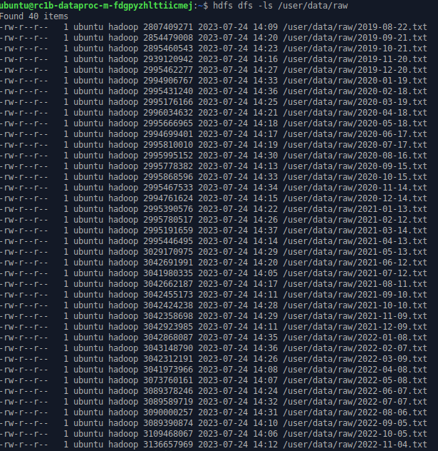

# Настройка облачной инфраструктуры для проекта по определению мошеннических транзакций

## Создание бакета

```bash
# создание статического ключа
yc iam access-key create --service-account-name otus-mlops --description "otus mlops service access key"
# создание бакета
s3cmd mb --acl-public --storage-class STANDARD s3://otus-mlops-course
# копирование данных
s3cmd cp --recursive --acl-public s3://mlops-data/fraud-data/ s3://otus-mlops-course/data/raw/
```

**Точка доступа**: s3://otus-mlops-course/data/raw

## Создание Spark-кластера

```bash
# создание кластера
yc dataproc cluster create --name=dataproc9df501bd \
                            --description="Test cluster for homework" \
                            --zone=ru-central1-b \
                            --service-account-name=otus-mlops \
                            --version=2.0 \
                            --services=HBASE,HDFS,YARN,SPARK,MAPREDUCE,ZOOKEEPER \
                            --ssh-public-keys-file=/home/alina/.ssh/id_rsa.pub \
                            --subcluster name=dataproc9df501bd_subcluster42c7,`
                                         `role=masternode,`
                                         `resource-preset=s3-c2-m8,`
                                         `disk-type=network-ssd,`
                                         `disk-size=40,`
                                         `subnet-name=default-ru-central1-b,`
                                         `hosts-count=1,`
                                         `assign-public-ip=true \
                            --subcluster name=dataproc9df501bd_subcluster883c,`
                                        `role=datanode,`
                                        `resource-preset=s3-c4-m16,`
                                        `disk-type=network-hdd,`
                                        `disk-size=128,`
                                        `subnet-name=default-ru-central1-b,`
                                        `hosts-count=3,`
                                        `assign-public-ip=true \
                            --security-group-ids=enp4n8cs1pm2i0c54bi3 \
                            --ui-proxy=true \
                            --bucket=otus-mlops-course
```

## Копирование данных из объектного хранилища в HDFS

```bash
#  установка и конфигурация s3cmd на мастер-ноде
sudo apt-get install -y s3cmd
s3cmd --configure

# создание папки с данными
hdfs dfs -mkdir /user/data

# копирование данных из object storage
hadoop distcp s3a://otus-mlops-course/data/raw /user/data    
```



## Подсчёт затрат за месяц

Без учёта входящего/исходящего трафика:

* **Spark-кластер 23 471,28 ₽**:
  * Master-нода: класс хоста s3-c2-m8, размер хранилища 40 ГБ
    | Compute Cloud  |  x1 | 3 601,20 ₽  |
    |---|---|---|
    |Intel Ice Lake   | 100% vCPU  |  1 512,00 ₽ |
    |Intel Ice Lake | RAM | 1 612.80 ₽
    |Быстрое сетевое хранилище | SSD | 476,40 ₽ |

  * Data-нода: класс хоста s3-c4-m16, 3 хоста, размер хранилища 128 Гб
    | Compute Cloud  |  x3 | 19 870,08 ₽  |
    |---|---|---|
    | Intel Ice Lake | 100% vCPU | 9 072,00 ₽ |
    | Intel Ice Lake | RAM | 9 676,80 ₽ |
    | Стандартное сетевое хранилище | HDD | 1 121,28 ₽ |

* **Объектное хранилище 850,22 ₽** (424 Гб,  $128 \times 3 + 40$)
* **Итого:** использование HDFS-хранилища дороже объектного в **27,61** раз

## Способы для оптимизации затрат на содержание Spark-кластера в облаке

* До того, как будут проводиться полноценные нагрузочные тесты, можно брать как можно меньше ресурсов (н.р. RAM, кол-во ядер)
* DataProc стоит дороже, т.к. идёт с готовым для работы ПО, поэтому можно попробовать настроить на обычной виртуалке либо Spark без hdfs (Spark может работать с s3), а если заказчик одобрит/даст своего DevOps'а можно настроить на виртуалке hadoop либо кубер с MinIO + Spark

## Обновление задач и канбан-доски

См. [доску проекта](https://github.com/users/ayeffkay/projects/1/views/1?layout=board).

## Удаление Spark-кластера

```bash
yc dataproc cluster delete dataproc9df501bd
```
