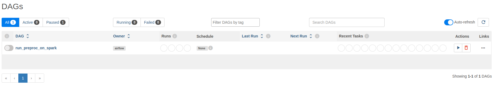
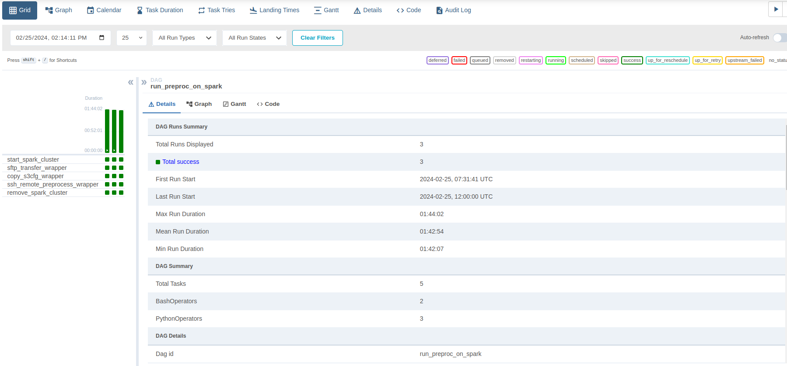
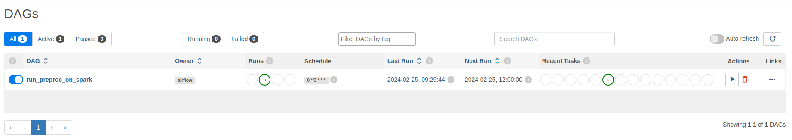
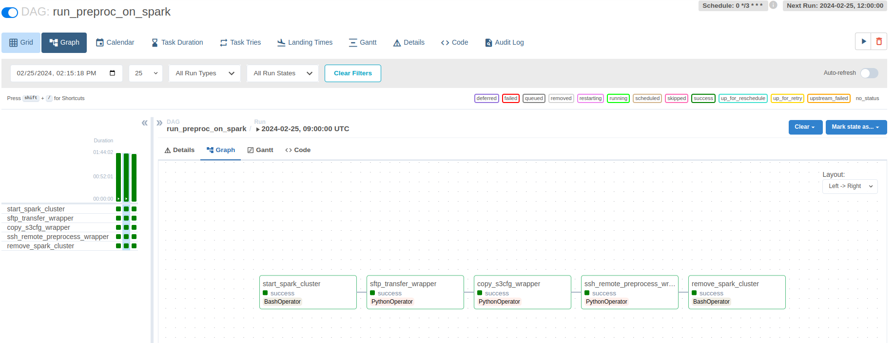

# Периодический запуск процедуры очистки датасета мошеннических финансовых транзакций

<!-- TOC -->

- [Периодический запуск процедуры очистки датасета мошеннических финансовых транзакций](#периодический-запуск-процедуры-очистки-датасета-мошеннических-финансовых-транзакций)
  - [Запуск Airflow](#запуск-airflow)
  - [Запуск DAG](#запуск-dag)
  - [Удаление виртуалки с Airflow](#удаление-виртуалки-с-airflow)

<!-- /TOC -->
Для удобства вспомогательные скрипты вызываются через [Makefile](./scripts/Makefile).

## Запуск Airflow

Ниже приведена последовательность команд для запуска Airflow на отдельной виртуалке:

```bash
    cd ./scripts
    # создание виртуалки на YC
    bash ./create_airflow_vm.sh
    # копирование вспомогательных скриптов и DAGов
    make airflow.copy_files
    # установка докера
    make airflow.install_docker
    # создание необходимых папок и инициализация переменных перед запуском докера
    make airflow.prepare_docker
    # проброс порта Airflow из виртуалки на локальную машину для запуска UI
    make airflow.forward_ui_port
```

Для запуска веб-интерфейса Airflow, необходимо на локальной машине выполнить команду:

```bash
    cd ./scripts 
    make local.run_airflow_ui
```

Чтобы Spark-кластер создавался и удалялся автоматически, предварительно внутри контейнера с Airflow нужно сгенерировать RSA-ключи, поставить утилиту yc и получить OAuth-токен:

```bash
    # на виртуалке с Airflow заходим внутрь контейнера
    make airflow.shell
    # генерим RSA-ключи и ставим YC
    chmod -R -f 777  ~/scripts/*.sh && bash ~/scripts/prepare_for_spark.sh
```

## Запуск DAG

* Скрин DAG из веб-интерфейса
  

* Код с DAG [run_preproc_on_spark](./dags/preprocess_by_schedule.py) содержит следующие задачи:
  * Создание Spark-кластера из VM с Airflow
  * Копирование [скрипта для предобработки данных](./scripts/preproc.py)
  * Запуск скрипта очистки и сохранение обработанных данных
  * Удаление Spark-кластера

Так как IP-адрес мастерноды меняется при создании кластера, он передаётся через xcom и все операторы, которым нужен IP, обёрнуты в PythonOperator. Для экономии времени и ресурсов запуск осуществлялся на небольшом бакете, содержащем один файл из датасета и DAG перезапускался каждые 3 часа.

Скрины успешных запусков




## Удаление виртуалки с Airflow

С локальной машины нужно выполнить команды:

```bash
    cd ./scripts
    make airflow.destroy_vm
```